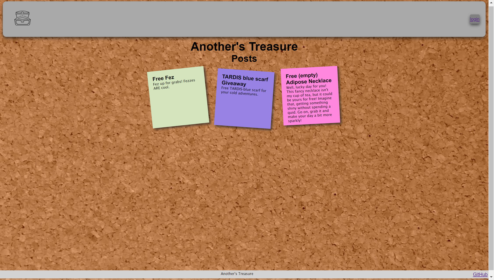

# Another's Treasure

## Description

Welcome to your one-stop destination for community resource sharing! A platform where neighbors can lend, borrow, and share resources. 
Another’s Treasure is here to foster connections, reduce waste, and build a stronger, more collaborative community. It's resource sharing made easy for everyone!

## Table of Contents

## Installation
You can view and contribute by goint to [ https://anothers-treasure-c22388db08db.herokuapp.com/]( https://anothers-treasure-c22388db08db.herokuapp.com/).

## Usage

Upon loading the app, the user will see community posts that others have placed to view.

In order to see more information, images, and to contact the poster, users will be guided to sign-up or log-in.

Once logged in they will be able to email the user of the post for more details. 

Users are also able to create and delete their own posts. 

## Future Devolopments 

1. **Update Post Function:**
   - Provide users with the ability to edit their posts after they've been published. This feature will enhance user experience and allow for corrections or updates to be made.

2. **Ability to Search by Location:**
   - Implement a location-based search feature to allow users to discover content, events, or other users based on their geographical proximity. This could enhance local community engagement and networking.

3. **Direct Messaging:**
   - Introduce a direct messaging feature to enable private conversations between users. This will enhance user interaction, foster communication, and provide a more comprehensive platform experience.

4. **Addition of Moderation Tools:**
   - Develop moderation tools to empower platform administrators and community managers to monitor and manage user-generated content effectively. This will help maintain a positive and respectful online environment.

5. **Post Like Feature:**
   - Integrate a "like" or "thumbs up" feature for posts to allow users to express appreciation or agreement with content. This feature can contribute to community engagement and help surface popular or valuable content.

6. **Ability to Add Images to Posts:**
   - Expand post capabilities by allowing users to attach images to their posts. This can enhance content diversity and engagement, enabling users to share visual information and experiences.

## Credits

Developers:
- AJ Generoso: https://github.com/ajgeneroso
- Juniper McGill: https://github.com/JuniperWrenMcGill
- Natalie Yaspo: https://github.com/NatalieYaspo

## License

MIT

## How to Contribute

Please reach out to the developers via GitHub to contribute.
